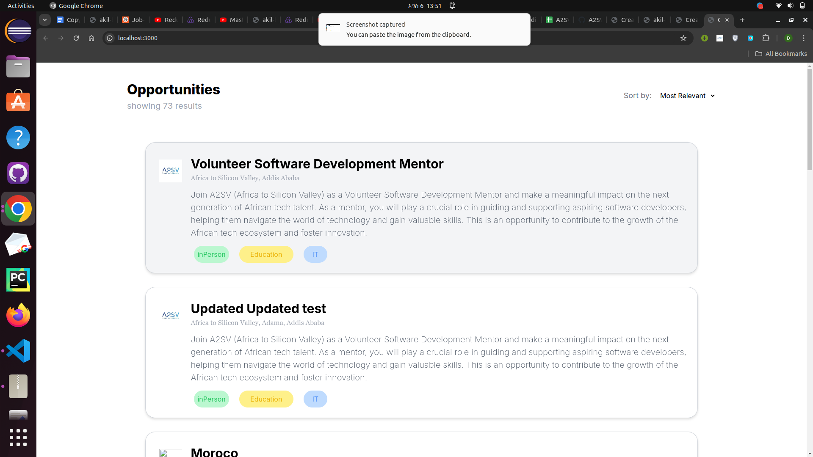
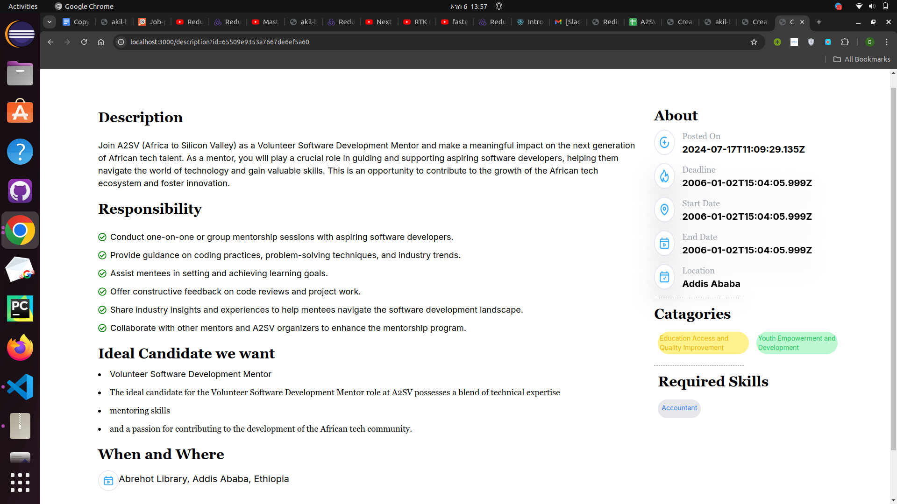

## Job Listing Dashboard
This project is a React application that includes a card component resembling a job listing, complete with an avatar image, and a Job Listing Dashboard to display multiple such cards. Below are the details on how to set up, run, and use the project.

## Features
Job Card Component: Displays job information, including an avatar image and dummy data.
job description component : displays the responsibility , age , about
## Screenshot

Here is a screenshot of the Job Listing Dashboard:


Here is a screenshot of the Job Listing Dashboard:

description of each 



## Installation
Prerequisites
Node.js and npm or Yarn installed on your machine. You can download Node.js from nodejs.org.
Getting Started
Installation
1 Clone the repository:

```git clone https://github.com/Emnet-tes/A2SV---Web-Learning-Tasks.git```
2 navigate to directory
```cd api-integration```
3 Install dependencies:
```npm install```

4 Start the Development Server
    Using npm:
    ```npm start```

This will start the development server and open the application in your default web browser 
