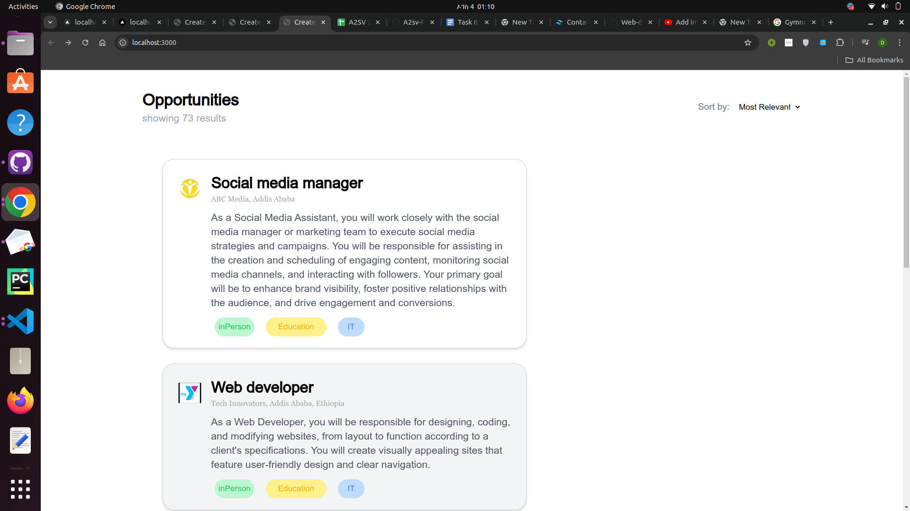

## Job Listing Dashboard
This project is a React application that includes a card component resembling a job listing, complete with an avatar image, and a Job Listing Dashboard to display multiple such cards. Below are the details on how to set up, run, and use the project.

## Features
Card Component: The Card component displays an individual card with title , location
Description component : responsibility
                        Description: Contains a brief description.
                        Additional Info: Displays any other relevant information.
## Screenshot

Here is a screenshot of the Job Listing Dashboard:

## Installation
Prerequisites
Node.js and npm You can download Node.js from nodejs.org.
nextjs framework
## Getting Started
Clone the Repository

Navigate to the Project Directory

cd job-listing-dashboard
Install Dependencies
Using npm:
npm install

## Usage
Start the Development Server

Using npm:
npm start
This will start the development server and open the application in your default web browser 
